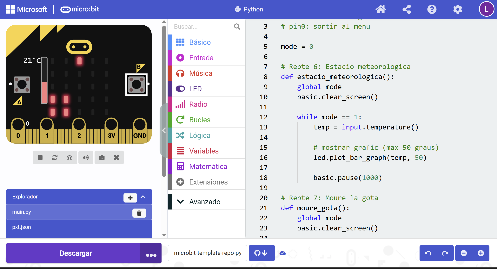

# Estació Meteorològica i Gota en Moviment 

Aquest programa mostra un **menú** amb dues funcions: una **estació meteorològica** i un joc de **moure una gota** inclinant el micro:bit.

## Menú 

En iniciar, el micro:bit mostra el **MENU**.

Pots triar entre:

* **Botó A → TEMP**: Estació meteorològica
* **Botó B → GOTA**: Moure la gota
* **Pin P0 → EXIT**: Tornar al menú quan estiguis dins d’un mode

## Mode 1: Estació meteorològica

Mostra contínuament la temperatura en forma de **gràfic de barres** (fins a 50 °C).
El mode funciona fins que premis **P0** per sortir al menú.

## 💧 Mode 2: Gota en moviment

Una gota (un LED encès) es mou segons la **inclinació** del micro:bit:

* Inclinació horitzontal → es mou a esquerra/dreta
* Inclinació vertical → es mou amunt/avall

La gota sempre es mou dins del rang de la matriu 5×5.
Prem **P0** per tornar al menú.

